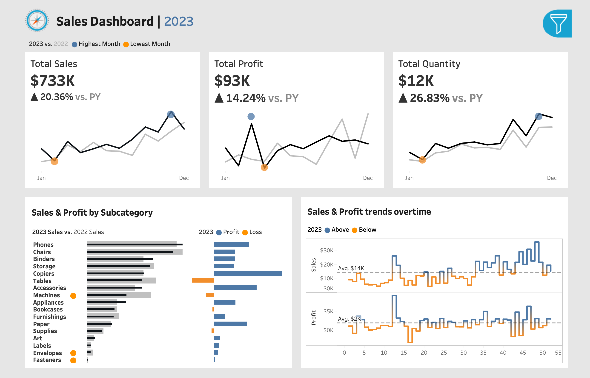
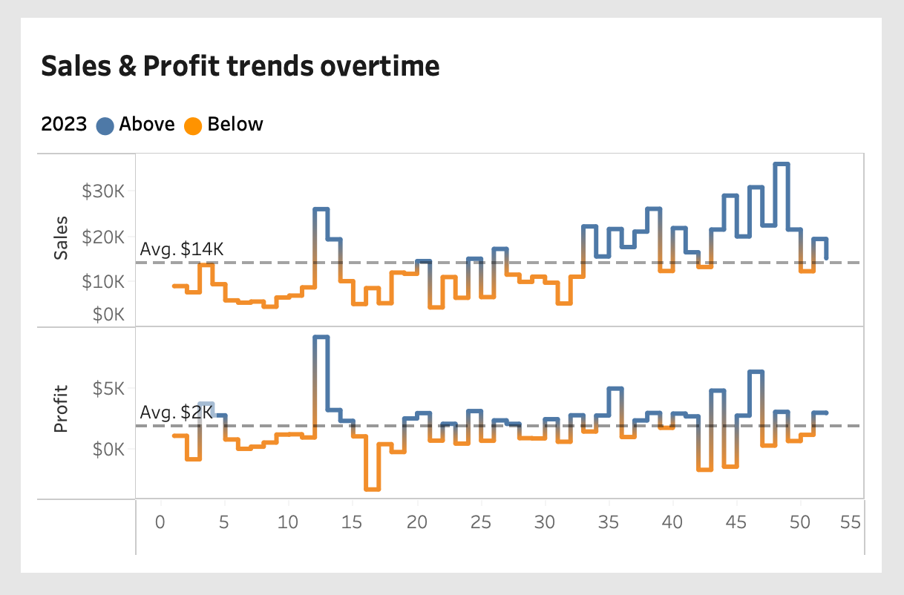
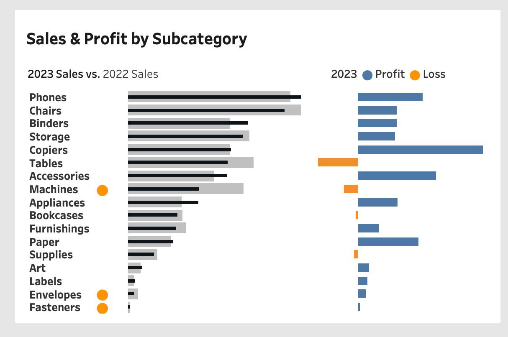

# 📊 Interactive Sales Analytics Dashboard | Tableau


## Overview

This project showcases an **interactive Tableau Sales Analytics Dashboard** developed to analyze business performance across sales, profitability, product categories, and weekly trends.

The dashboard enables stakeholders to monitor core business KPIs, identify performance patterns, and support **data-driven decision making** through interactive visual analytics.

---

## Business Problem

Business stakeholders require a centralized analytical view to understand:

- Overall sales performance
- Profitability behavior across products
- Product subcategory contribution
- Weekly sales movement and performance trends

Without a structured dashboard, identifying high-performing categories, monitoring business health, and making informed operational decisions becomes difficult.

This project addresses these challenges through an **interactive business intelligence dashboard built in Tableau**.

---

## Business Objectives

✔ Track overall sales performance

✔ Monitor profit generation

✔ Analyze product subcategory performance

✔ Identify weekly business trends

✔ Support business decision-making through KPI visibility

---

## Tech Stack

| Tool | Purpose |
|------|------|
| Tableau | Dashboard Development |
| Tableau Public | Dashboard Deployment |
| GitHub | Project Documentation & Portfolio |

---

## Dashboard Features

### KPI Monitoring

The dashboard tracks core business KPIs including:

- **Total Sales**
- **Total Profit**
- **Total Quantity Sold**

---

### Trend Analysis

Weekly sales trends are visualized to identify:

- Sales fluctuations
- Performance patterns
- Business activity changes over time

---

### Product Performance Analysis

Subcategory analysis helps evaluate:

- Revenue contribution
- Profitability behavior
- Product-level performance differences

---

### Profitability Analysis

Sales and profit relationships are analyzed to identify:

- High-sales low-profit products
- Strong-margin categories
- Business optimization opportunities

---

### Interactive Dashboard Experience

Dashboard interactivity includes:

- Dynamic filtering
- Drill-down exploration
- Interactive business analysis

---

## Dashboard Preview

### Full Dashboard View



---

### Trend Analysis



---

### Product Analysis



---

## KPI Definitions

| KPI | Definition |
|------|------|
| **Total Sales** | Total revenue generated from transactions |
| **Total Profit** | Net profitability generated from sales activities |
| **Total Quantity** | Total units sold across products |
| **Weekly Sales Trend** | Sales movement tracked over time |
| **Subcategory Performance** | Product-level contribution to business performance |

---

## Stakeholder Questions Addressed

This dashboard helps answer important business questions such as:

1. Which products drive the highest sales performance?

2. Are strong sales translating into strong profitability?

3. How does business performance fluctuate weekly?

4. Which product segments require optimization?

5. How can KPI monitoring support strategic decisions?

---

## Key Insights

### Sales Performance

Business performance varies significantly across product categories and product groups.

### Profitability Behavior

Higher revenue does not always correspond to stronger profit generation.

### Product Analysis

Certain subcategories contribute disproportionately to business performance.

### Trend Analysis

Weekly patterns reveal fluctuations that can influence forecasting, planning, and operational decision-making.

---

## Business Recommendations

### Optimize High-Performing Categories

Increase focus on categories demonstrating strong revenue and profitability performance.

---

### Improve Margin Performance

Investigate products with strong sales but weaker profit contribution.

---

### Strengthen Forecasting

Use weekly trend monitoring to support better planning and operational forecasting.

---

### Continuous KPI Monitoring

Leverage dashboard KPIs regularly to enable proactive business decision-making.

---

## Live Dashboard

🔗 **Tableau Public Dashboard**

View Dashboard Here:

https://public.tableau.com/app/profile/lohith.reddy6156/viz/salesDashboard_17797804648910/SalesDashboard

---

## Project Workflow

```txt
Business Data
    ↓
Data Exploration
    ↓
KPI Design
    ↓
Dashboard Development (Tableau)
    ↓
Interactive Analytics
    ↓
Business Insights
    ↓
Decision Support
```

---

## Repository Structure

```txt
sales-analytics-dashboard-tableau/
│
├── README.md
│
├── tableau/
│   └── sales Dashboard.twbx
│
├── dashboards/
│   ├── dashboard_preview.png
│   ├── kpi_section.png
│   ├── trend_analysis.png
│   └── subcategory_analysis.png
│
└── assets/
    ├── github_banner.png
    └── workflow.png
```

---

## Skills Demonstrated

- Data Visualization
- Dashboard Design
- KPI Development
- Business Analytics
- Sales Analysis
- Stakeholder Reporting
- Tableau
- Business Intelligence
- Product Analytics Thinking

---

## Author

**Lohith Reddy**

 **Product Data Analyst** focused on business analytics, dashboard development, and product-driven decision support.

